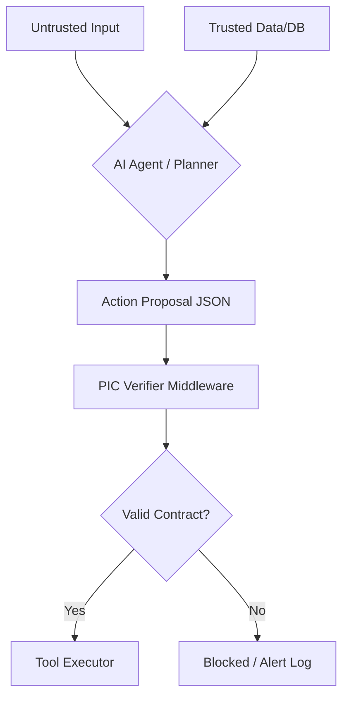

# <p> PIC Standard: Provenance & Intent Contracts</p>
**The Open Protocol for Causal Governance in Agentic AI.**

PIC closes the **causal gap**: when untrusted inputs (prompt injection, user text, web pages) influence **high‑impact side effects** (payments, exports, infra changes), PIC forces a **machine‑verifiable contract** between *what the agent claims* and *what evidence actually backs it*.

[](LICENSE)
[]()

---

## Quickstart

```bash
# Install core (schema + verifier + CLI)
pip install pic-standard

# Verify an example proposal
pic-cli verify examples/financial_irreversible.json
# ✅ Schema valid
# ✅ Verifier passed
```

**Optional extras:**
```bash
pip install "pic-standard[langgraph]"  # LangGraph integration
pip install "pic-standard[mcp]"        # MCP integration
pip install "pic-standard[crypto]"     # Signature evidence (Ed25519)
```

**From source (contributors):**
```bash
git clone https://github.com/madeinplutofabio/pic-standard.git
cd pic-standard && pip install -e .
pytest -q  # run tests
```

---

## The PIC Contract

PIC uses an **Action Proposal JSON** (protocol: `PIC/1.0`). The agent emits it right before executing a tool:

| Field | Purpose |
|-------|---------|
| `intent` | What the agent is trying to do |
| `impact` | Risk class (`money`, `privacy`, `irreversible`, …) |
| `provenance` | Which inputs influenced the decision (and their trust level) |
| `claims` + `evidence` | What the agent asserts and which evidence IDs support it |
| `action` | The actual tool call being attempted (tool binding) |

**Verifier rule:** For high‑impact proposals (`money`, `privacy`, `irreversible`), at least one claim must reference evidence from **TRUSTED** provenance. Fail‑closed.

---

## Evidence Verification

PIC supports deterministic evidence verification that upgrades provenance trust **in-memory**.

| Version | Type | Description |
|---------|------|-------------|
| v0.3 | `hash` | SHA-256 verification of file artifacts (`file://...`) |
| v0.4 | `sig` | Ed25519 signature verification via trusted keyring |

```bash
# Verify hash evidence
pic-cli evidence-verify examples/financial_hash_ok.json

# Verify signature evidence
pic-cli evidence-verify examples/financial_sig_ok.json

# Full pipeline: schema → evidence → verifier
pic-cli verify examples/financial_hash_ok.json --verify-evidence
```

📖 **Full guide:** [docs/evidence.md](docs/evidence.md)

---

## Keyring (Trusted Signers)

Signature evidence requires a keyring of trusted public keys.

```bash
# Inspect current keyring
pic-cli keys

# Generate starter keyring
pic-cli keys --write-example > pic_keys.json
```

PIC loads keys from `PIC_KEYS_PATH` env var, or `./pic_keys.json`, or empty (no signers).

📖 **Full guide:** [docs/keyring.md](docs/keyring.md) — key formats, expiry, revocation, rotation

---

## Integrations

### LangGraph

Enforce PIC at the tool boundary with `PICToolNode`:

```bash
pip install "pic-standard[langgraph]"
python examples/langgraph_pic_toolnode_demo.py
```

- Requires `__pic` proposal in each tool call
- Validates schema + verifier + tool binding
- Returns `ToolMessage` outputs

---

### MCP (Model Context Protocol)

Enforce PIC at the MCP tool boundary with production defaults:

```bash
pip install "pic-standard[mcp]"
python -u examples/mcp_pic_client_demo.py
```

- Fail‑closed (blocks on verifier/evidence failure)
- Debug gating (`PIC_DEBUG=1` for diagnostics)
- Request tracing, DoS limits, evidence sandboxing

---

### OpenClaw

Plugin for OpenClaw AI agents via the hook API:

```bash
# 1. Start the PIC bridge
pip install pic-standard
pic-cli serve --port 7580

# 2. Build and install the plugin
cd integrations/openclaw
npm install && npm run build
openclaw plugins install .
# Or manually: cp -r . ~/.openclaw/extensions/pic-guard/
```

- `pic-gate` — verifies proposals before tool execution
- `pic-init` — injects PIC awareness at session start
- `pic-audit` — structured audit logging

📖 **Full guide:** [docs/openclaw-integration.md](docs/openclaw-integration.md)

---

## How It Works



---

## Why PIC?

> Guardrails constrain **what the model says**. PIC constrains **what the agent is allowed to do** (side effects) based on **verifiable provenance + evidence**.

---

## Versioning

- `PIC/1.0` — the proposal protocol (schema)
- Python package follows **Semantic Versioning**

---

## Roadmap

- [✅] Phase 1: Standardize money and privacy Impact Classes
- [✅] Phase 2: Reference Python verifier + CLI
- [✅] Phase 3: Anchor integrations (LangGraph + MCP)
- [✅] Phase 4: Evidence verification (hash + signature)
- [✅] Phase 5: OpenClaw integration
- [⬜] Phase 6: Additional SDKs (TypeScript) + case studies + audit

---

## Community

We're actively seeking:
- Security researchers to stress‑test causal logic
- Framework authors to build native integrations
- Enterprise architects to define domain Impact Classes

Maintained by [ @fmsalvadori](https://www.linkedin.com/in/fmsalvadori/)
&nbsp;
[ MadeInPluto](https://github.com/madeinplutofabio)
