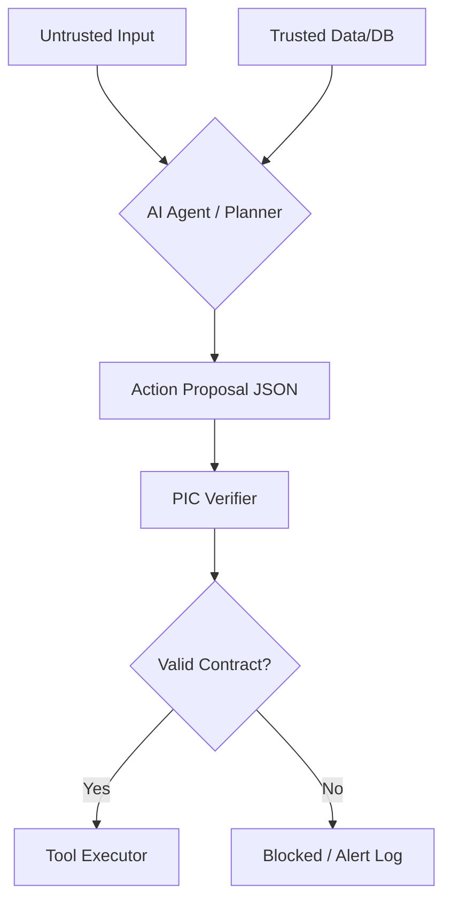

# <p> PIC Standard: Provenance & Intent Contracts</p>

**Make your AI agents safe, auditable & production-ready. No rogue actions, no blind trust.**

[](https://pypi.org/project/pic-standard/)
[](https://github.com/madeinplutofabio/pic-standard/actions/workflows/ci.yml)
[](https://github.com/madeinplutofabio/pic-standard)
[](https://github.com/madeinplutofabio/pic-standard/blob/main/LICENSE)

PIC is a lightweight, local-first protocol that forces AI agents to **prove** every important action before it happens. Agents must declare intent, risk, provenance, and evidence; PIC verifies everything and **fails closed** if anything is wrong.

*No more hallucinations turning into wire transfers. No more prompt injections triggering data exports.*

**Example:** An LLM agent decides to send a $500 payment based on a user message. PIC requires the agent to prove: *where did this instruction come from? Is the source trusted? Is there evidence the invoice is real?* If any answer is missing or wrong, the action is blocked before it reaches the payment API.

---

## Table of Contents

- [Why PIC?](#why-pic)
- [Quickstart](#quickstart)
- [The PIC Contract](#the-pic-contract)
- [How It Works](#how-it-works)
- [Evidence Verification](#evidence-verification)
- [Keyring (Trusted Signers)](#keyring-trusted-signers)
- [Integrations](#integrations)
- [Roadmap](#roadmap)
- [Contributing](#contributing)

---

## Why PIC?

> Guardrails constrain **what the model says**. PIC constrains **what the agent is allowed to do** based on **verifiable provenance + evidence**.

- **Stops prompt injections & blind tool calls** at the action boundary
- **Works 100% locally**: zero cloud, zero data leaves your machine
- **Plugs into your stack in minutes**: LangGraph, MCP, OpenClaw, Cordum
- **Open-source (Apache 2.0)**:audit it, fork it, own it

---

## Quickstart
```bash
pip install pic-standard

# Verify an example proposal
pic-cli verify examples/financial_irreversible.json
# Schema valid
# Verifier passed
```

**Optional extras:**
```bash
pip install "pic-standard[langgraph]"  # LangGraph PICToolNode
pip install "pic-standard[mcp]"        # MCP tool guarding
pip install "pic-standard[crypto]"     # Ed25519 signature evidence
```

**From source (contributors):**
```bash
git clone https://github.com/madeinplutofabio/pic-standard.git
cd pic-standard && pip install -e ".[langgraph,mcp,crypto]"
pytest -q
```

---

## The PIC Contract

Agents emit an **Action Proposal** (`PIC/1.0`) before every tool call:

| Field | Purpose |
|-------|---------|
| `intent` | What the agent is trying to do |
| `impact` | Risk class: `money`, `privacy`, `irreversible`, `compute`, ... |
| `provenance` | Which inputs influenced the decision (with trust levels) |
| `claims` + `evidence` | What the agent asserts and the evidence backing it |
| `action` | The actual tool call (tool binding) |

**Rule:** For high-impact proposals, at least one claim must reference evidence from **trusted** provenance. Fail-closed.

---

## How It Works


---

## Evidence Verification

PIC supports deterministic evidence verification that upgrades provenance trust in-memory.

| Type | Description |
|------|-------------|
| `hash` | SHA-256 verification of file artifacts (`file://...`) |
| `sig` | Ed25519 signature verification via trusted keyring |
```bash
# Verify hash evidence
pic-cli verify examples/financial_hash_ok.json --verify-evidence

# Verify signature evidence
pic-cli verify examples/financial_sig_ok.json --verify-evidence
```

Full guide: [docs/evidence.md](docs/evidence.md)

---

## Keyring (Trusted Signers)

Signature evidence requires a keyring of trusted public keys with expiry and revocation support.
```bash
pic-cli keys                        # Inspect current keyring
pic-cli keys --write-example        # Generate starter keyring
```

Full guide: [docs/keyring.md](docs/keyring.md)

---

## Integrations

### LangGraph

Guard any tool node with `PICToolNode`:
```bash
pip install "pic-standard[langgraph]"
python examples/langgraph_pic_toolnode_demo.py
```

- Validates schema + verifier + tool binding per tool call
- Returns `ToolMessage` outputs

---

### MCP (Model Context Protocol)

Enterprise tool guarding with production defaults:
```bash
pip install "pic-standard[mcp]"
python -u examples/mcp_pic_client_demo.py
```

- Fail-closed, request tracing, DoS limits, evidence sandboxing
- Debug gating (`PIC_DEBUG=1`)

---

### OpenClaw

TypeScript plugin for OpenClaw AI agents (hook API):
```bash
# Start the PIC bridge
pic-cli serve --port 7580

# Install the plugin
cd integrations/openclaw && npm install && npm run build
openclaw plugins install .
```

- `pic-gate` — verifies proposals before tool execution
- `pic-init` — injects PIC awareness at session start
- `pic-audit` — structured audit logging

Full guide: [docs/openclaw-integration.md](docs/openclaw-integration.md)

---

### Cordum

Go Pack providing PIC verification as a Cordum workflow gate step:

- `job.pic-standard.verify` worker topic with fail-closed design
- Three-way routing: `proceed` / `fail` / `require_approval`
- Pack manifest with schemas, overlays, and simulation tests

Full guide: [docs/cordum-integration.md](docs/cordum-integration.md)

---

### HTTP Bridge (any language)

For non-Python integrations, PIC exposes an HTTP bridge:
```bash
pic-cli serve --port 3100
# POST /verify with {tool_name, tool_args}
# GET /health
```

---

## Roadmap

- [x] Phase 1: Standardize Impact Classes (money, privacy, irreversible, ...)
- [x] Phase 2: Reference Python verifier + CLI
- [x] Phase 3: Anchor integrations (LangGraph + MCP)
- [x] Phase 4: Evidence verification (hash + Ed25519 signatures)
- [x] Phase 5: OpenClaw + Cordum integrations
- [ ] Phase 6: TypeScript SDK + audit dashboard + case studies

---

## Contributing

We welcome contributions! See [CONTRIBUTING.md](CONTRIBUTING.md) for how to propose changes or report issues.

We're actively seeking:
- Security researchers to stress-test causal logic
- Framework authors to build native integrations
- Enterprise architects to define domain Impact Classes

If you find PIC useful, please consider giving us a star on GitHub: it helps attract more security experts and framework authors into the community.

Issues & ideas: [GitHub Issues](https://github.com/madeinplutofabio/pic-standard/issues)

Maintained by [ @fmsalvadori](https://www.linkedin.com/in/fmsalvadori/)
&nbsp;
[ MadeInPluto](https://github.com/madeinplutofabio)
Maintained by [ @fmsalvadori](https://www.linkedin.com/in/fmsalvadori/)
&nbsp;
[ MadeInPluto](https://github.com/madeinplutofabio)
